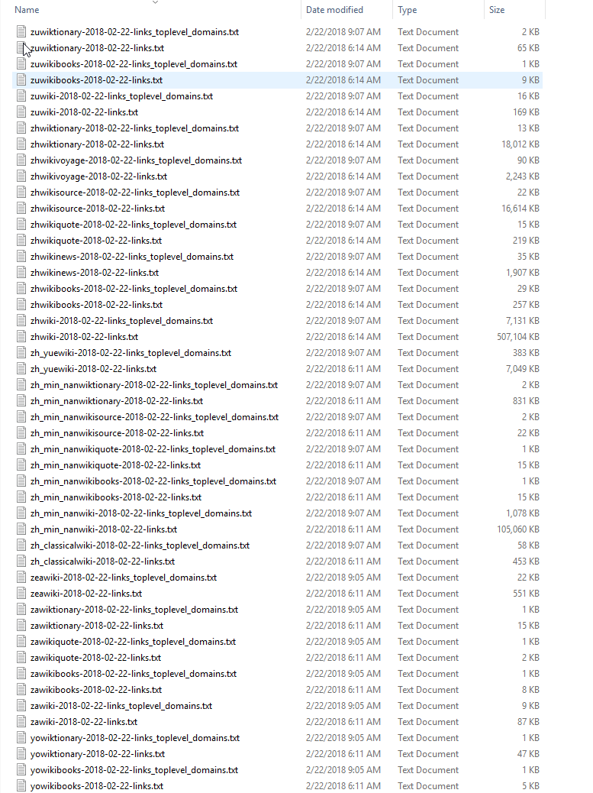

# wiki-external-links
Downloads all external links from [official wikipedia database dumps.](https://dumps.wikimedia.org/backup-index.html)

Run main.py

Give it some time...

Total: ~5 milions top-level domains

